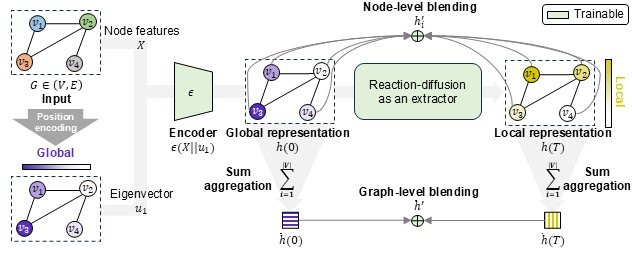
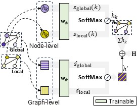

# Blending Global-local Representations for Robust Graph Classification
 
## Setup
```
$ conda install --yes -c pytorch pytorch=1.13.1 torchvision cudatoolkit=11.6
$ pip install -r requirements.txt
```
---
## Run
```
$ python main.py --dataset $dataset$ --epochs $epochs$ --hidden_dim $d_k$ --time $T$  --step_size $tau$ --lambda $lambda$
```

